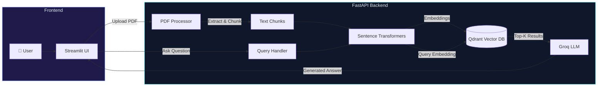

<p align="center">
  <h1 align="center">🧠 RAG System</h1>
  <p align="center">
    <strong>Intelligent Document Q&A powered by Groq, Qdrant & FastAPI</strong>
  </p>
  <p align="center">
    Upload PDFs. Ask questions. Get AI-generated answers grounded in your documents.
  </p>
</p>

<p align="center">
  <a href="https://www.python.org/downloads/"></a>
  <a href="https://fastapi.tiangolo.com"></a>
  <a href="https://streamlit.io"></a>
  <a href="https://groq.com"></a>
  <a href="https://qdrant.tech"></a>
  <a href="LICENSE"></a>
</p>

---

## ✨ Features

- **📄 PDF Upload & Indexing** — Automatically extract text, chunk it, generate embeddings, and index into Qdrant
- **💬 Conversational Q&A** — Ask natural language questions and get context-aware answers from your documents
- **🔍 Source Attribution** — Every answer includes source chunks with relevance scores so you can verify
- **📚 Document Management** — List, view, and delete indexed documents through the UI or API
- **⚡ Blazing Fast Inference** — Powered by Groq's ultra-low-latency LLM API
- **🎨 Beautiful Dark-Mode UI** — Premium Streamlit frontend with gradient accents, animations, and chat interface
- **⚙️ Fully Configurable** — Tune chunk size, overlap, top-k retrieval, model selection via environment variables

---

## 🏗️ Architecture



**How it works:**

1. **Upload** — PDFs are parsed with PyMuPDF, split into overlapping chunks, embedded via Sentence Transformers, and stored in Qdrant
2. **Query** — Your question is embedded, similar chunks are retrieved from Qdrant, and Groq generates an answer grounded in those chunks
3. **Respond** — The answer is returned along with source attributions and confidence scores

---

## 🚀 Getting Started

### Prerequisites

| Requirement | Version |
|------------|---------|
| Python | 3.11+ |
| Docker | Latest |
| Groq API Key | [Get one here →](https://console.groq.com) |

### Installation

**1. Clone the repository**

```bash
git clone https://github.com/avi-gajera/RAG.git
cd RAG
```

**2. Create a virtual environment**

```bash
python -m venv venv

# Windows
venv\Scripts\activate

# macOS/Linux
source venv/bin/activate
```

**3. Install dependencies**

```bash
pip install -r requirements.txt
```

**4. Configure environment variables**

```bash
cp .env.example .env
```

Open `.env` and add your Groq API key:

```env
GROQ_API_KEY=your_groq_api_key_here
```

**5. Start Qdrant (Vector Database)**

```bash
docker compose up -d
```

**6. Start the Backend**

```bash
uvicorn backend.main:app --host 0.0.0.0 --port 8001 --reload
```

**7. Start the Frontend**

```bash
streamlit run frontend/app.py
```

The app will be available at **http://localhost:8501** 🎉

---

## 📡 API Reference

The FastAPI backend exposes a REST API with interactive docs at `http://localhost:8001/docs`.

| Method | Endpoint | Description |
|--------|----------|-------------|
| `GET` | `/health` | Health check — returns Qdrant & embedding model status |
| `POST` | `/upload` | Upload and index a PDF document |
| `POST` | `/query` | Ask a question using the RAG pipeline |
| `GET` | `/documents` | List all indexed documents |
| `DELETE` | `/documents/{id}` | Delete a document and its chunks |

### Example: Upload a PDF

```bash
curl -X POST http://localhost:8001/upload \
  -F "file=@document.pdf"
```

### Example: Ask a Question

```bash
curl -X POST http://localhost:8001/query \
  -H "Content-Type: application/json" \
  -d '{"question": "What is the main topic of the document?", "top_k": 5}'
```

---

## ⚙️ Configuration

All settings are managed via environment variables (`.env` file):

| Variable | Description | Default |
|----------|-------------|---------|
| `GROQ_API_KEY` | Your Groq API key | **(required)** |
| `GROQ_MODEL` | LLM model to use | `openai/gpt-oss-120b` |
| `QDRANT_HOST` | Qdrant server host | `localhost` |
| `QDRANT_PORT` | Qdrant server port | `6333` |
| `COLLECTION_NAME` | Qdrant collection name | `documents` |
| `CHUNK_SIZE` | Text chunk size (characters) | `1000` |
| `CHUNK_OVERLAP` | Overlap between chunks | `200` |
| `TOP_K` | Number of chunks to retrieve | `5` |

---

## 📁 Project Structure

```
RAG/
├── backend/
│   ├── __init__.py
│   ├── config.py                # Pydantic Settings — loads .env
│   ├── main.py                  # FastAPI app & API endpoints
│   ├── models/
│   │   ├── __init__.py
│   │   └── schemas.py           # Request/response Pydantic models
│   └── rag/
│       ├── __init__.py
│       ├── embeddings.py        # Sentence Transformers embeddings
│       ├── groq_client.py       # Groq LLM integration
│       ├── pdf_processor.py     # PDF extraction & text chunking
│       └── vector_store.py      # Qdrant vector store operations
├── frontend/
│   └── app.py                   # Streamlit chat UI
├── data/
│   └── uploads/                 # Uploaded PDF storage
├── .env.example                 # Environment variable template
├── .gitignore
├── docker-compose.yml           # Qdrant Docker setup
├── requirements.txt
└── README.md
```

---

## 🛠️ Tech Stack

| Component | Technology |
|-----------|------------|
| **Backend Framework** | [FastAPI](https://fastapi.tiangolo.com) |
| **Frontend** | [Streamlit](https://streamlit.io) |
| **LLM Provider** | [Groq](https://groq.com) |
| **Vector Database** | [Qdrant](https://qdrant.tech) |
| **Embeddings** | [Sentence Transformers](https://www.sbert.net) (`all-MiniLM-L6-v2`) |
| **PDF Processing** | [PyMuPDF](https://pymupdf.readthedocs.io) |
| **Text Splitting** | [LangChain Text Splitters](https://python.langchain.com) |
| **Configuration** | [Pydantic Settings](https://docs.pydantic.dev) + [python-dotenv](https://github.com/theskumar/python-dotenv) |

---

## 🤝 Contributing

Contributions are welcome! Here's how to get started:

1. **Fork** the repository
2. **Create** a feature branch (`git checkout -b feature/amazing-feature`)
3. **Commit** your changes (`git commit -m 'Add amazing feature'`)
4. **Push** to the branch (`git push origin feature/amazing-feature`)
5. **Open** a Pull Request

---

## 📄 License

This project is licensed under the **MIT License** — see the [LICENSE](LICENSE) file for details.

---

<p align="center">
  <sub>Built with ❤️ by <a href="https://github.com/avi-gajera">avi-gajera</a></sub>
</p>
